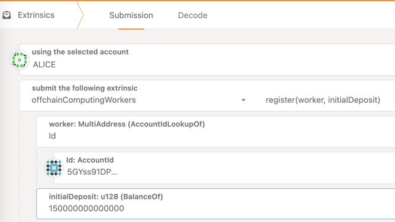
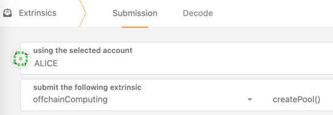
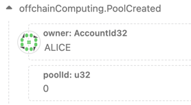
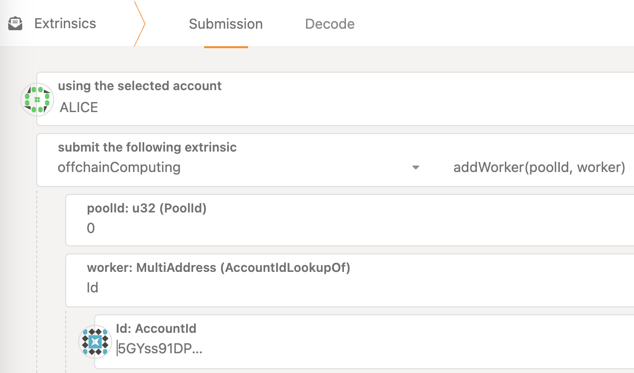
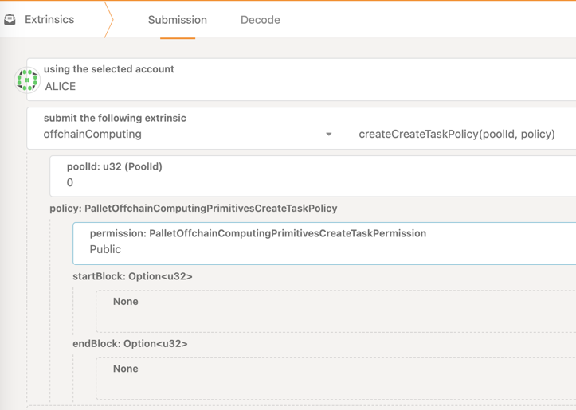
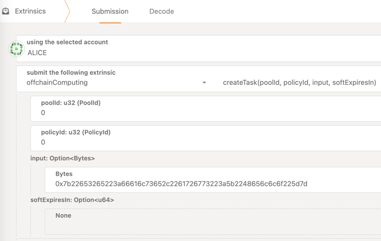

Guides
====

## Referenced off-chain computing protocol implementation

> Note: Current implementation is just an early prototype and will be rewritten in the future.

In `protocol_impl` directory, there is a referenced off-chain computing protocol implementation,
current based on Deno, it workable and shows how the protocol works.

### How to run it

`./run.sh --owner-phrase "//Alice" --subscribe-pool 0`

`--owner-phrase <MNEMONIC>` is optional, not recommends on production, given this arg,
the impl will try to register the worker automatically.

`--subscribe-pool <POOL_ID>` is required, it points out the worker should listen which pool.

### How to customize it

`protocol_impl/task_executor` directory contains the Deno program that actual handle tasks,
just edit `main.ts`.

### How to get the worker address

Worker address is the worker's on-chain identity and wallet.

Worker will use the wallet to submit transactions to fulfill the protocol demands,
so you need to monitor its balance, or it will offline because of can't answer on-chain challenge.

In most management extrinsic calls, you will need the address to locate the worker.

The worker address shall print on the impl starting, for example:
`Worker address: 5CmLkeupoN7tSthSD6hFj9wHYc9RyMRAWb38uo5BD6LEViGw`

### How to register worker manually

> Note: the fee's and balance requirements may change in the future

- Open <https://polkadot.js.org/apps/#/extrinsics>, ensure you are on the correct endpoint
- Ensure you have more than 101 CBT on the owner's wallet
- Submit offchainComputingWorkers.register(worker, initialDeposit)
  
  - `worker` is the worker's address
  - `initialDeposit` is the amount that will be transferred from the owner to the worker's wallet
    - Current setting 100 CBT will be used as reserved money, the rest will be used as gas fee of the workers
    - 101 CBT is the minimum, you should give more (e.g. 150 CBT)
    - You should monitor worker's free balance, charge it when it's nearly exhausted
    - As screenshot shows, 150 CBT should be input as `150000000000000` (`150` with 12 times `0`)

## How to prepare a pool

> Note: the fee's and balance requirements may change in the future

Pool is the unit to process tasks

### Create your pool

- Open <https://polkadot.js.org/apps/#/extrinsics>, ensure you are on the correct endpoint
- Ensure you have more than 1 CBT on the owner's wallet
- Submit `offchainComputing.createPool()`
  
- Switch to Network -> Explorer page, from `offchainComputing.PoolCreated` event, you shall get your pool id
  

### Add your worker(s) to a pool

- Open <https://polkadot.js.org/apps/#/extrinsics>, ensure you are on the correct endpoint
- You must use the wallet which you used to create the pool
- Submit `offchainComputing.addWorker(poolId, worker)`
  
  - You can add any worker to your pool, but a pool can only have 100 workers for now, and worker may not listen to your pool
  - You can remove worker from your pool, call `offchainComputing.removeWorker(poolId, worker)`

### Add creating task policy

Creating task policy controls who can submit new task, in the future, it also contains how to charge for a task, and more. 
When creating new task, user must specify a policy by `policyId`

- Open <https://polkadot.js.org/apps/#/extrinsics>, ensure you are on the correct endpoint
- You must use the wallet which you used to create the pool
- Submit `offchainComputing.createCreatingTaskPolicy(poolId, policy)`
  
  - `permission` can choose `Owner` or `Public`
    - When choose `Owner`, only the pool's owner can create task
    - When choose `Public`, anyone can create task
    - In the future, it will support `AllowList` for only selected people can create task
  - Optional `startBlock` and `endBlock` are used for control the valid period of the policy
  - You can delete a policy, call `offchainComputing.destroyCreatingTaskPolicy(poolId, policyId)`

## How to create task

- Open <https://polkadot.js.org/apps/#/extrinsics>, ensure you are on the correct endpoint
- Ensure you have enough CBT to create task
- Submit `offchainComputing.createTask(poolId, policyId, input, softExpiresIn)`
  
  - You need to choose a valid creating task policy by `policyId`
  - `input` depends on your task processor
  - `softExpiresInSeconds` is optional
  - Create task shall reserve some of your money, depends on the `input` size

## How to destroy task to unlock your reserved money

- Open <https://polkadot.js.org/apps/#/extrinsics>, ensure you are on the correct endpoint
- You must use the wallet which you used to create the task
- You can destroy the task when:
  - The task still pending to process
  - The task has processed
- Call `offchainComputing.destroyTask(poolId, taskId)`

## How to destroy expired task

> Note: In the future, help to destroy expired task would reward a small tip

- Open <https://polkadot.js.org/apps/#/extrinsics>, ensure you are on the correct endpoint
- You can be anyone
- The task must be expired
- Call `offchainComputing.destroyExpiredTask(poolId, taskId)`
